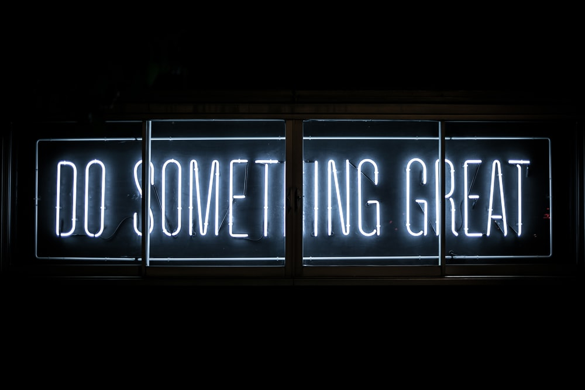

(.center)

# Hi there 👋

##My Name is Lamonte 

👋 Hi, I’m @Lamonte Scott
👀 I’m interested in mobile, game, web, UI, UX, and backend development.
🌱 I’m currently learning two powerful programming languages C++ and C#.
I'm improving as a 3D Artist and animator with Blender 2.92.
💞️ I’m looking to collaborate on projects that will push me to improve as an developer.
📫 How to reach me is here on GitHub.
P.S. I will forever be a student at learning the mysterious world of software development.Images/doSomethingGreat.jpeg